# Causal Machine Learning for Identifying Drug-Associated Kidney Stone Risk Using NHANES

We use NHANES 2007-2018 data to estimate causal effects of prescription drug classes on kidney stone risk using augmented inverse probability weighting (AIPW), with XGBoost prediction and SHAP interpretability.

## Dataset

- **Source**: [NHANES](https://wwwn.cdc.gov/nchs/nhanes/Default.aspx) (National Health and Nutrition Examination Survey), cycles 2007-2018
- **Sample**: 34,679 adults (20+) with valid kidney stone questionnaire responses
- **Outcome**: Self-reported kidney stone history (KIQ026) — 3,234 cases (9.3%)
- **Features**: 103 columns including demographics, serum chemistry, urine labs, comorbidities, lifestyle, and 20 drug class indicators

### NHANES Components Used

| Component | Files | Description |
|-----------|-------|-------------|
| KIQ_U | Kidney Conditions | Kidney stone outcome (KIQ026) |
| RXQ_RX | Prescription Medications | Drug names, duration, count |
| BIOPRO | Biochemistry Profile | Serum calcium, uric acid, creatinine, etc. |
| ALB_CR | Albumin & Creatinine | Urine albumin, creatinine |
| DEMO | Demographics | Age, sex, race, income, education |
| BMX | Body Measures | BMI, waist circumference |
| BPX | Blood Pressure | Systolic/diastolic BP |
| MCQ | Medical Conditions | CHF, CHD, stroke, cancer |
| DIQ | Diabetes | Diabetes status |
| BPQ | Blood Pressure Questionnaire | Hypertension, high cholesterol |
| SMQ | Smoking | Smoking status |
| SLQ | Sleep | Sleep hours |
| PAQ | Physical Activity | Vigorous/moderate activity |

## Pipeline

```
01_download_data.py  →  Download/copy 78 NHANES XPT files
02_preprocess.py     →  Merge, clean, feature engineer → analysis_ready.parquet
03_eda.py            →  Descriptive stats, correlation matrix, plots
04_causal_analysis.py →  AIPW causal effects, subgroup CATEs, forest plot
05_prediction.py     →  Logistic regression, XGBoost, SHAP
06_results.py        →  Executive summary, final figure panel
```

### Setup

```bash
pip install -r requirements.txt
brew install libomp  # macOS only, required for XGBoost
```

### Run

```bash
python 01_download_data.py
python 02_preprocess.py
python 03_eda.py
python 04_causal_analysis.py
python 05_prediction.py
python 06_results.py
```

## Results

### Causal Effects of Drug Classes on Kidney Stone Risk (AIPW)

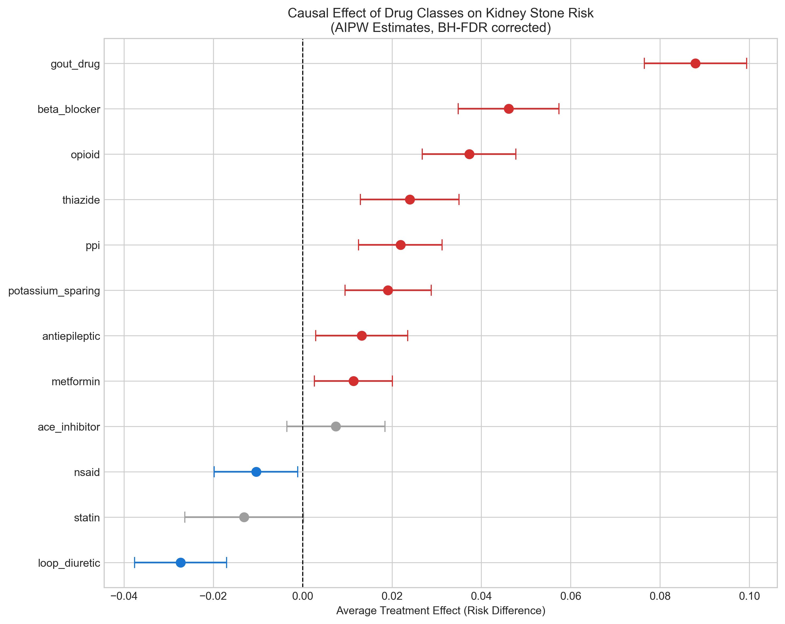

| Drug Class | N Users | ATE (Risk Difference) | 95% CI | Significant (FDR) | E-value |
|---|---|---|---|---|---|
| Gout drugs | 564 | +8.8% | [7.7%, 9.9%] | Yes | 3.30 |
| Beta blockers | 4,439 | +4.6% | [3.5%, 5.7%] | Yes | 2.35 |
| Opioids | 2,237 | +3.7% | [2.7%, 4.8%] | Yes | 2.15 |
| Thiazides | 3,479 | +2.4% | [1.3%, 3.5%] | Yes | 1.83 |
| PPIs | 3,265 | +2.2% | [1.3%, 3.1%] | Yes | 1.77 |
| Potassium-sparing | 720 | +1.9% | [1.0%, 2.9%] | Yes | 1.70 |
| Antiepileptics | 1,638 | +1.3% | [0.3%, 2.4%] | Yes | 1.54 |
| Metformin | 2,870 | +1.1% | [0.3%, 2.0%] | Yes | 1.49 |
| ACE inhibitors | 4,694 | +0.7% | [-0.4%, 1.8%] | No | — |
| NSAIDs | 1,874 | -1.0% | [-2.0%, -0.1%] | Yes | 1.50 |
| Statins | 6,695 | -1.3% | [-2.6%, 0.0%] | No | — |
| Loop diuretics | 1,303 | -2.7% | [-3.8%, -1.7%] | Yes | 2.18 |

### Crude Drug Class Stone Rates

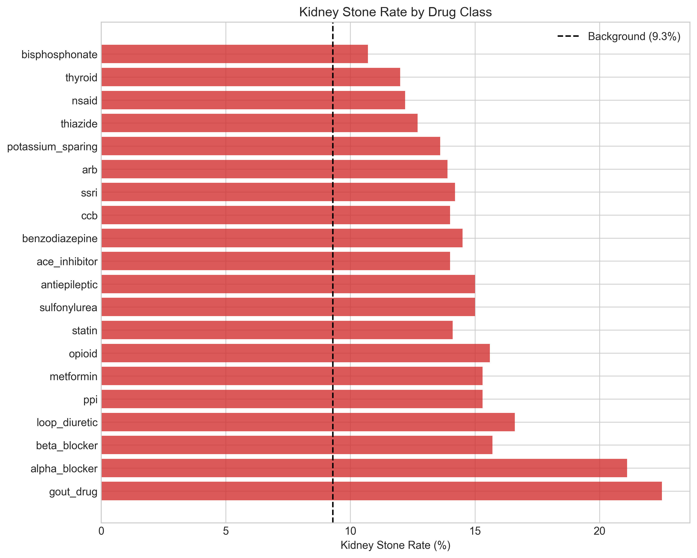

### Predictive Model Performance

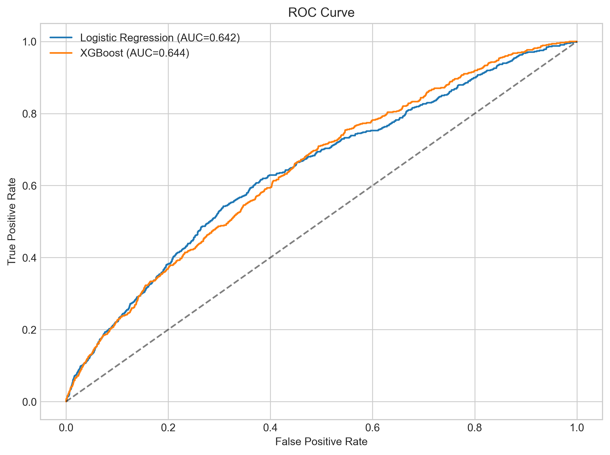

| Model | ROC-AUC | PR-AUC |
|---|---|---|
| Logistic Regression | 0.642 | 0.162 |
| XGBoost | 0.644 | 0.162 |

### SHAP Feature Importance

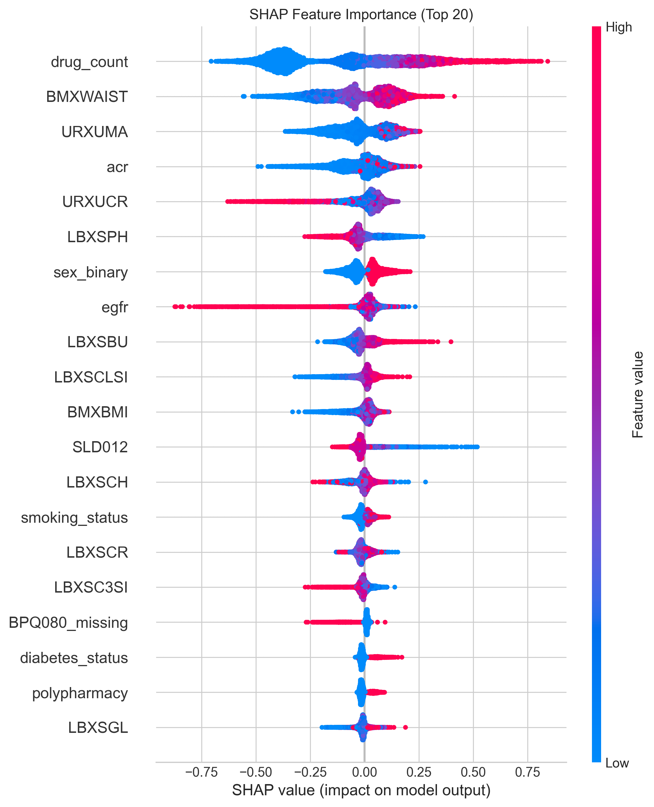

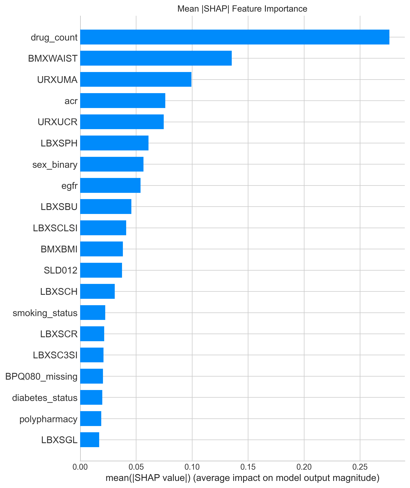

### Feature Distributions by Stone Status

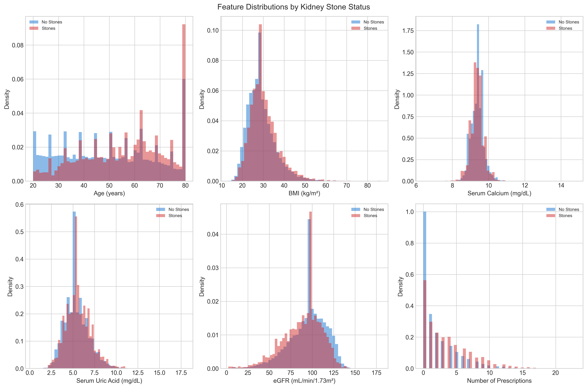

### Correlation Matrix

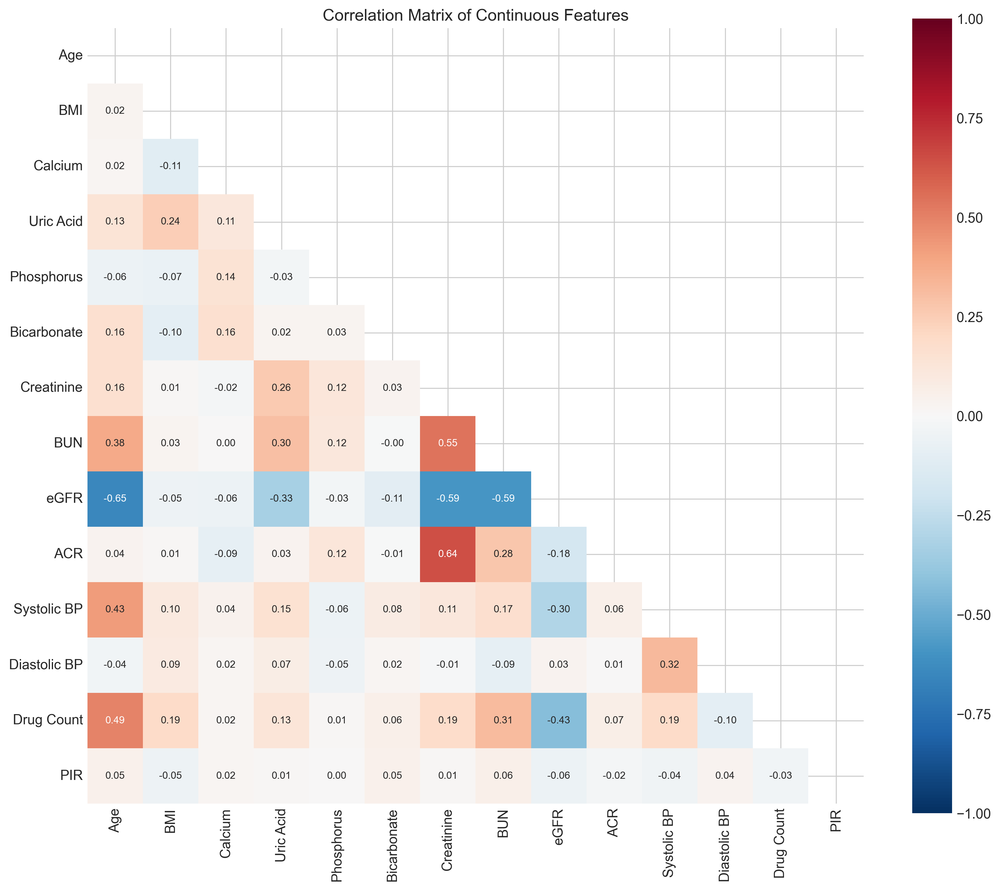

### Polypharmacy and Stone Risk

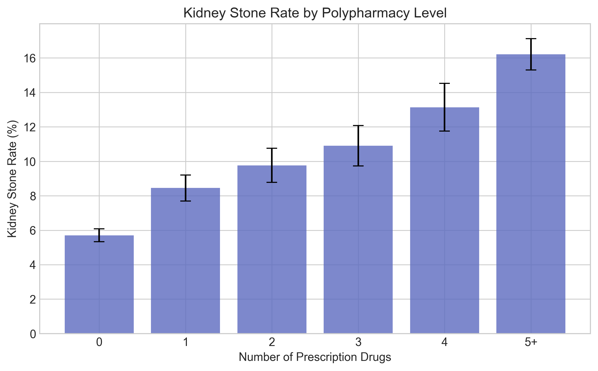

### Precision-Recall Curve

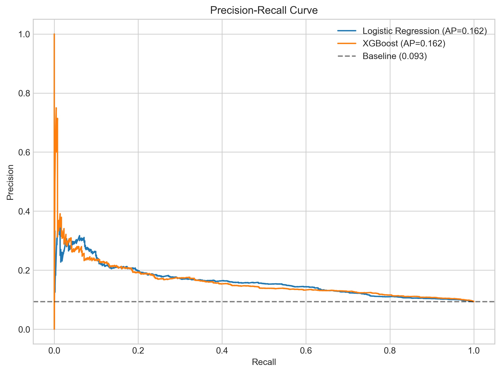

### Calibration Plot

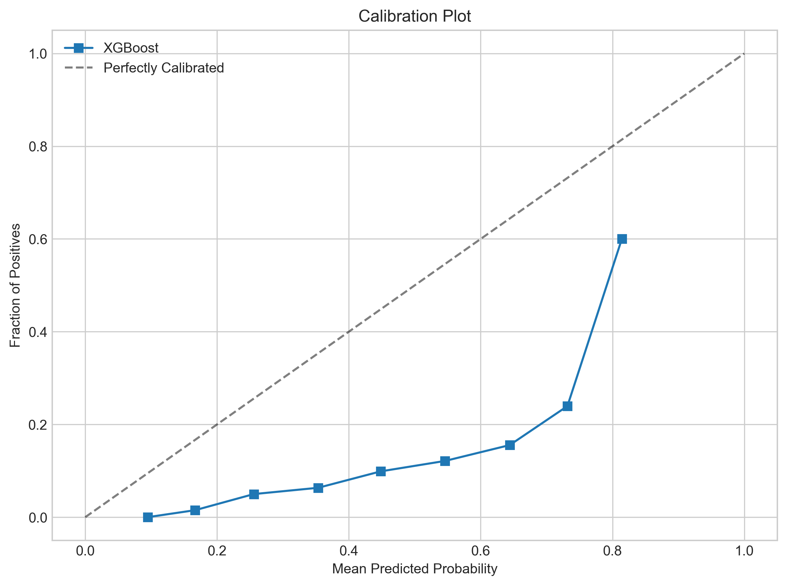

### Main Figure Panel

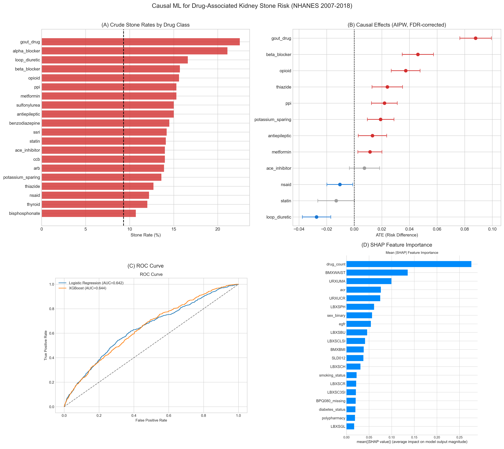

## Key Findings

1. **Gout drugs** show the largest causal effect (+8.8%), but this is likely confounding by indication — gout patients have high uric acid, which independently causes stones
2. **Loop diuretics** appear protective (-2.7%), consistent with their mechanism of reducing calcium reabsorption
3. **NSAIDs** show a modest protective effect (-1.0%)
4. **Antiepileptics** (including topiramate) show a small but significant effect (+1.3%), consistent with carbonic anhydrase inhibition
5. **Statins** and **ACE inhibitors** show no significant causal effect after adjustment

## Limitations

- NHANES is cross-sectional: kidney stone history (ever) vs current drug use — temporal ambiguity
- Unmeasured confounding remains possible (E-values quantify minimum confounding strength needed)
- Self-reported outcome may undercount asymptomatic stones
- Confounding by indication is severe for gout drugs and alpha blockers (tamsulosin prescribed FOR stones)
- No urine chemistry (pH, oxalate, citrate) available in NHANES

## Project Structure

```
ML4H/
├── config.py                  # Central configuration
├── drug_classes.py            # Drug name → class mapping
├── 01_download_data.py        # Data download
├── 02_preprocess.py           # Preprocessing pipeline
├── 03_eda.py                  # Exploratory data analysis
├── 04_causal_analysis.py      # Causal inference (AIPW)
├── 05_prediction.py           # XGBoost + SHAP
├── 06_results.py              # Results compilation
├── requirements.txt
├── data/
│   ├── raw/                   # 78 NHANES XPT files
│   └── processed/             # analysis_ready.parquet
└── outputs/
    ├── figures/               # All plots
    ├── tables/                # CSV summary tables
    └── models/                # XGBoost model, SHAP values
```
